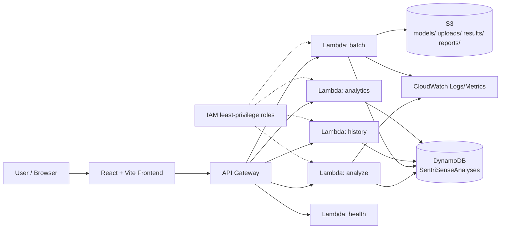

# SentriSense
### Serverless AI-Powered Sentiment and Opinion Intelligence Platform

*Cloud-Based Intelligent Sentiment Analysis and Opinion Monitoring Using Serverless Architecture*

> **Status:** Phase 0 — project scaffolding. No ML models trained yet, no AWS resources deployed yet.

---

## 1. Problem Statement

Most academic sentiment-analysis projects optimize purely for classification accuracy and treat
deployment as an afterthought. In a serverless context, however, accuracy is only one axis of a
larger trade-off space that includes **cold-start latency, memory footprint, inference time, and
per-invocation cost**.

**Research question:**
> How can lightweight NLP models be deployed in a serverless environment while maintaining a
> suitable balance between sentiment-analysis accuracy, inference latency, model size, resource
> utilization, scalability, and cloud execution cost?

## 2. Research Gap

Existing sentiment-analysis systems frequently emphasize classification accuracy while giving
comparatively less attention to deployment-oriented constraints such as serverless cold starts,
inference latency, model footprint, memory allocation, scalability, and execution cost.

SentriSense addresses this gap experimentally by training and comparing multiple modeling
approaches (classical ML vs. lightweight Transformer), measuring their real deployment
characteristics on AWS Lambda, and reporting the accuracy-vs-efficiency trade-off with actual
measured data — not assumptions.

This is presented as an **implementation and experimental study**, not a claim of an entirely
unexplored research area.

## 3. Research Questions & Hypotheses

| # | Research Question |
|---|---|
| RQ1 | How does model complexity affect sentiment-analysis accuracy? |
| RQ2 | How does model complexity affect serverless inference latency? |
| RQ3 | How does Lambda memory allocation influence inference latency? |
| RQ4 | What is the trade-off between accuracy and serverless efficiency? |
| RQ5 | Can lightweight NLP models provide sufficient accuracy while significantly improving serverless deployment efficiency? |

| # | Hypothesis |
|---|---|
| H1 | Increasing model complexity improves classification performance but increases deployment/inference overhead. |
| H2 | Increasing Lambda memory allocation reduces inference latency up to a point of diminishing returns. |
| H3 | A lightweight classical NLP model may offer a better accuracy-to-cost/latency trade-off than a Transformer for serverless deployment. |

All three are treated as **hypotheses to be tested in Phase 17 (Research Experiments)**, not
pre-decided conclusions.

## 4. System Architecture (high level)



Full diagrams (ML pipeline, batch flow, deployment pipeline) live in `docs/architecture/`
(added starting Phase 2).

## 5. Technology Stack

| Layer | Technology |
|---|---|
| ML / NLP | scikit-learn (TF-IDF + Logistic Regression / Linear SVM), HuggingFace Transformers (DistilBERT, comparison only) |
| Backend | Python 3.11, AWS Lambda, FastAPI (local dev mirror) |
| API | Amazon API Gateway (REST) |
| Database | Amazon DynamoDB (on-demand) |
| Storage | Amazon S3 |
| Monitoring | Amazon CloudWatch |
| IAM | Least-privilege roles per function |
| IaC | AWS SAM (`infrastructure/template.yaml`) |
| Frontend | React 18 + Vite + Tailwind CSS + Recharts |
| Testing | pytest, moto (AWS mocking), Vitest |

## 6. Datasets

| Dataset | Use | Source |
|---|---|---|
| IMDb Large Movie Review Dataset (50k reviews) | Primary training/eval | https://ai.stanford.edu/~amaas/data/sentiment/ |
| SST-2 (Stanford Sentiment Treebank) | Generalization check | https://huggingface.co/datasets/stanfordnlp/sst2 |
| Small domain review set (optional) | Aspect/domain testing | Amazon/Yelp/Kaggle review data — license documented in `data/README.md` |

Dataset acquisition and licensing notes are handled in **Phase 1**.

## 7. Project Structure

```
sentrisense/
├── backend/        # Lambda handlers + shared utils + tests
├── ml/             # data, preprocessing, training, evaluation, models, notebooks
├── frontend/        # React + Vite app
├── infrastructure/  # AWS SAM template + IAM policies
├── experiments/     # model_comparison, latency, cold_start, cost measurement scripts+results
├── docs/            # architecture, research, api, deployment docs
└── reports/          # figures + result tables for the final report
```

## 8. Team Work Distribution

| Person | Workstream |
|---|---|
| **Person 1 — Machine Learning** | Dataset, preprocessing, model training/comparison, evaluation, emotion model, aspect sentiment, model optimization/serialization, research experiments |
| **Person 2 — Cloud / Backend** | Lambda, API Gateway, DynamoDB, S3, IAM, CloudWatch, SAM, REST APIs, auth, deployment, monitoring |
| **Person 3 — Frontend / Analytics** | React app, dashboard, analyze/batch/history/analytics pages, charts, API integration, UI/UX, responsive design |

All three contribute to integration testing and the final report.

## 9. Development Phases

Phase 0 (this commit) → Phase 22 (final documentation). Full phase list in `docs/research/phases.md`
(added once Phase 1 starts). We proceed **one phase at a time**, with explicit confirmation
before moving on — see project rules in `docs/` once populated.

## 10. Local Setup (Windows / VS Code)

See **Section "Prerequisites & Setup"** below in this same conversation for the exact PowerShell
commands. Summary:

```powershell
# Python virtual environment
python -m venv .venv
.venv\Scripts\Activate.ps1
pip install -r requirements.txt

# Frontend
cd frontend
npm install
cd ..
```

Full local run instructions (training a model, running the local API, starting the frontend)
arrive in Phases 3, 7, and 13 respectively — they require code that doesn't exist yet.

## 11. Cost Notice

This project uses AWS Lambda, API Gateway, DynamoDB (on-demand), S3, and CloudWatch — all
usage-based services chosen to fit a student budget. **AWS charges depend on your account
configuration, region, usage volume, and current Free Tier eligibility — usage is not
guaranteed to be free.** A resource cleanup guide will be provided in `docs/deployment/` before
final deployment.

## 12. License & Attribution

Dataset licenses and third-party attributions are tracked in `docs/resources.md`.

---
*This README will be expanded at each phase. Do not consider it final documentation until
Phase 22.*
